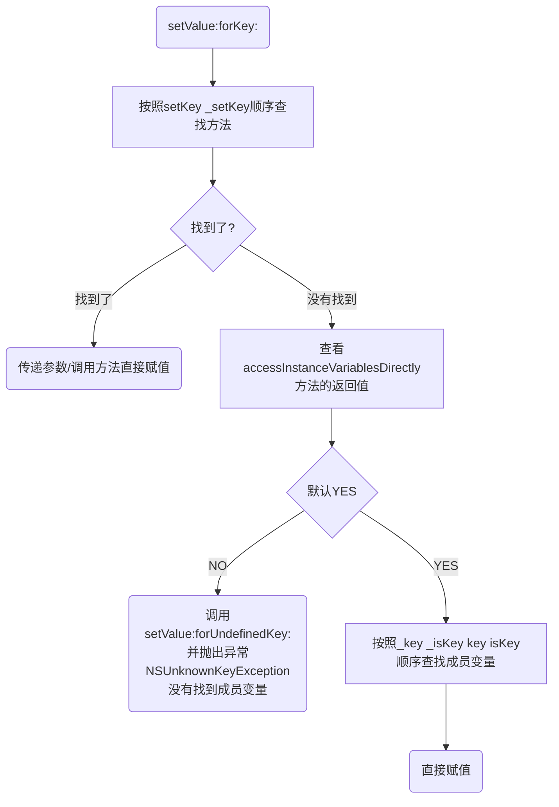
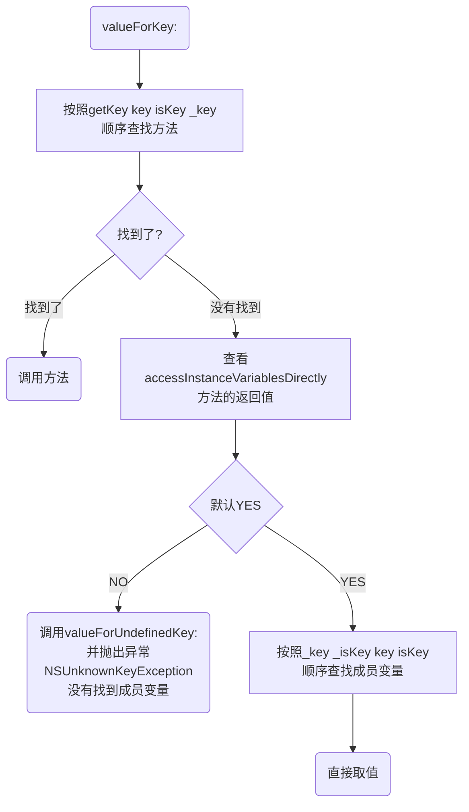
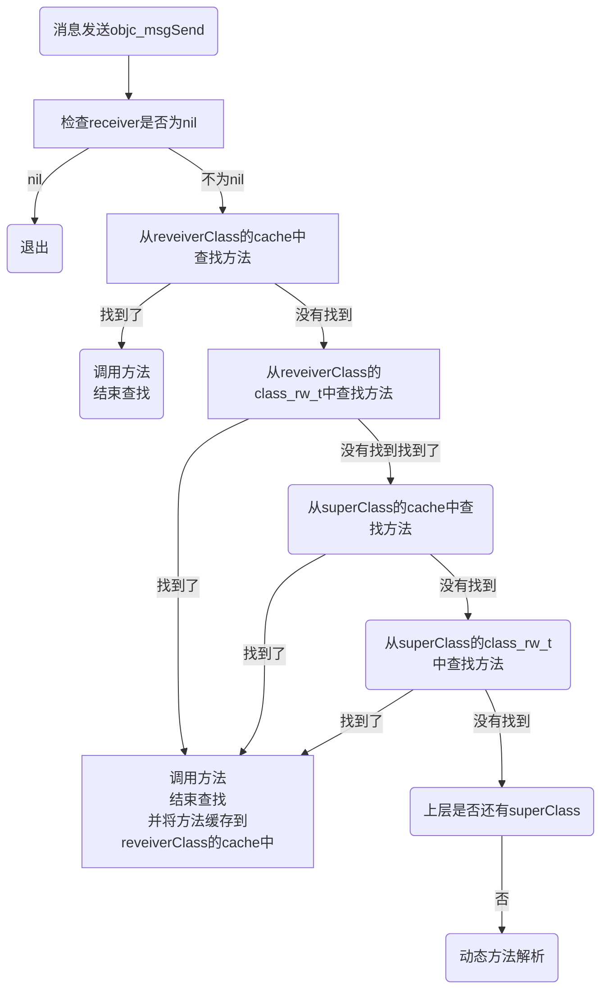
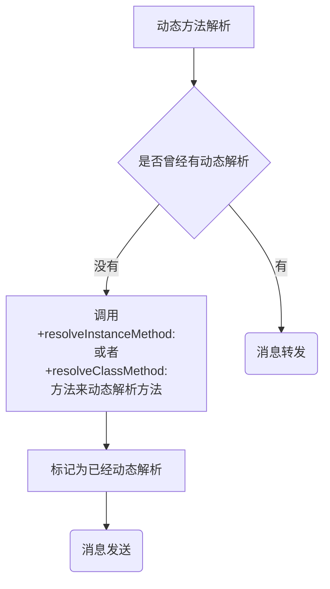
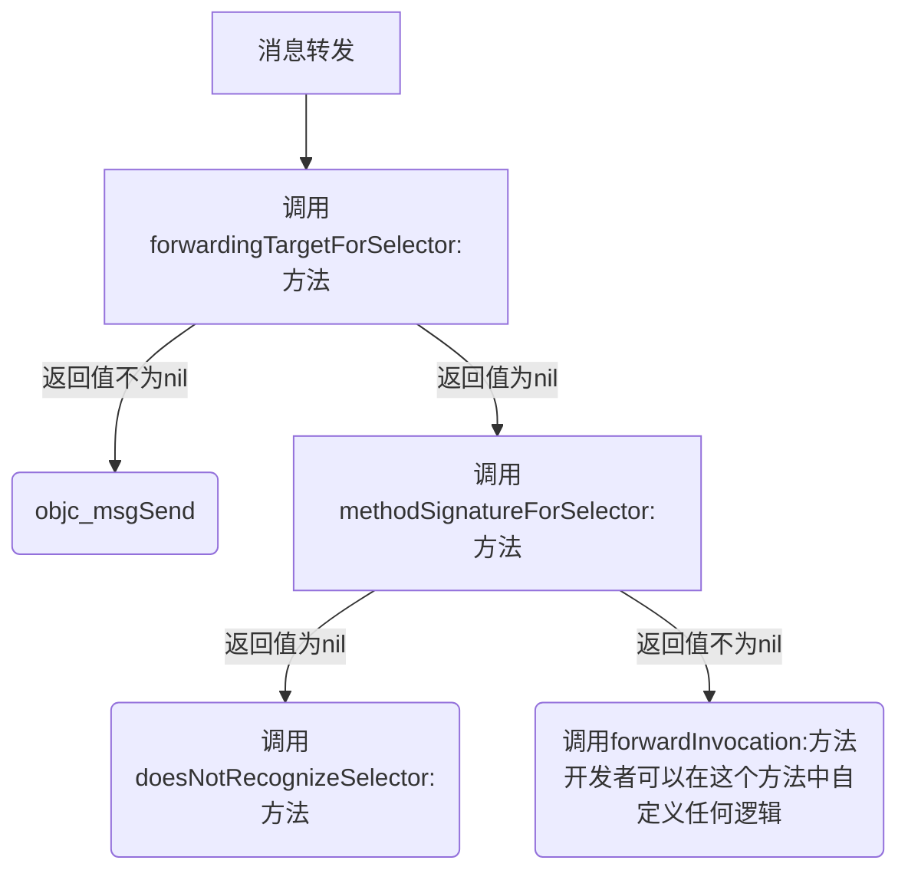

- [1. OC语法](#1-oc语法)
  - [iOS用什么方式实现对一个对象的KVO？(KVO的本质是什么？)](#ios用什么方式实现对一个对象的kvokvo的本质是什么)
  - [简述一下KVC？](#简述一下kvc)
  - [KVC的赋值和取值过程是怎样的？原理是什么？](#kvc的赋值和取值过程是怎样的原理是什么)
  - [Category的使用场合是什么？Category的实现原理？](#category的使用场合是什么category的实现原理)
  - [Category和Class Extension的区别是什么？](#category和class-extension的区别是什么)
  - [Category中有load方法吗？load方法是什么时候调用的？load 方法能继承吗？](#category中有load方法吗load方法是什么时候调用的load-方法能继承吗)
  - [Category能否添加成员变量？如果可以，如何给Category添加成员变量？](#category能否添加成员变量如果可以如何给category添加成员变量)
  - [load、initialize方法的区别什么？它们在category中的调用的顺序？以及出现继承时他们之间的调用过程？](#loadinitialize方法的区别什么它们在category中的调用的顺序以及出现继承时他们之间的调用过程)
  - [讲一下atomic的实现机制；为什么不能保证绝对的线程安全（最好可以结合场景来说）？](#讲一下atomic的实现机制为什么不能保证绝对的线程安全最好可以结合场景来说)
  - [从property看安全隐患](#从property看安全隐患)
  - [OC对象的分类](#oc对象的分类)
  - [isa、superclass](#isasuperclass)
  - [Block的本质](#block的本质)
  - [\_\_weak、\_\_strong的实现原理](#__weak__strong的实现原理)
  - [为什么iOS的Masonry中的self不会循环引用?](#为什么ios的masonry中的self不会循环引用)
  - [iOS 闭包中的\[weak self\]在什么情况下需要使用，什么情况下可以不加?](#ios-闭包中的weak-self在什么情况下需要使用什么情况下可以不加)
  - [为什么 block 里面还需要写一个 strong self，如果不写会怎么样？](#为什么-block-里面还需要写一个-strong-self如果不写会怎么样)
  - [iOS block 为什么用copy修饰](#ios-block-为什么用copy修饰)
- [2. Runtime](#2-runtime)
  - [什么是Runtime？平时项目中有用过么？](#什么是runtime平时项目中有用过么)
  - [OC 的消息机制](#oc-的消息机制)
- [3. RunLoop](#3-runloop)
  - [什么是RunLoop？](#什么是runloop)
  - [RunLoop与线程](#runloop与线程)
  - [RunLoop的运行逻辑？](#runloop的运行逻辑)
  - [RunLoop在实际开中的应用？](#runloop在实际开中的应用)
- [4. 多线程](#4-多线程)
  - [线程安全的本质是什么？为什么会出现多线程不安全？](#线程安全的本质是什么为什么会出现多线程不安全)
  - [在 iOS 中，常用的多线程方案有几种？](#在-ios-中常用的多线程方案有几种)
  - [iOS中的线程锁有哪些？](#ios中的线程锁有哪些)
  - [iOS线程同步方案性能比较](#ios线程同步方案性能比较)
  - [自旋锁、互斥锁比较](#自旋锁互斥锁比较)
  - [NSOperationQueue 和 GCD 的区别，以及各自的优势](#nsoperationqueue-和-gcd-的区别以及各自的优势)
  - [如何设计一个线程安全的可变数组？](#如何设计一个线程安全的可变数组)
      - [读写锁pthread\_rwlock](#读写锁pthread_rwlock)
      - [栅栏+并发队列 (dispatch\_barrier)](#栅栏并发队列-dispatch_barrier)
      - [dispatch\_semaphore\_t信号量](#dispatch_semaphore_t信号量)
- [5. 内存管理](#5-内存管理)
  - [使用CADisplayLink、NSTimer有什么注意点？](#使用cadisplaylinknstimer有什么注意点)
  - [iOS程序的内存布局](#ios程序的内存布局)
  - [Tagged Pointer](#tagged-pointer)
  - [OC对象的内存管理](#oc对象的内存管理)
  - [引用计数的存储](#引用计数的存储)
  - [dealloc](#dealloc)
  - [自动释放池](#自动释放池)
  - [Runloop和Autorelease](#runloop和autorelease)
- [6. 性能优化](#6-性能优化)
  - [卡顿优化 - CPU](#卡顿优化---cpu)
  - [卡顿优化 - GPU](#卡顿优化---gpu)
  - [离屏渲染](#离屏渲染)
  - [卡顿检测](#卡顿检测)
  - [耗电的主要来源](#耗电的主要来源)
  - [耗电优化](#耗电优化)
  - [APP的启动](#app的启动)
  - [APP的启动优化](#app的启动优化)
  - [安装包瘦身](#安装包瘦身)
- [7. 设计模式、架构](#7-设计模式架构)
  - [设计模式（Design Pattern）](#设计模式design-pattern)
  - [项目管理](#项目管理)
- [8. HHTPS](#8-hhtps)
  - [密码学](#密码学)
    - [对称加密](#对称加密)
    - [非对称加密](#非对称加密)
    - [对称加密非对称加密对比](#对称加密非对称加密对比)
    - [摘要算法：](#摘要算法)
    - [CA认证](#ca认证)
  - [什么是 HTTP](#什么是-http)
  - [什么是 HTTPS](#什么是-https)
  - [什么是 SSL/TLS](#什么是-ssltls)
  - [TCP/IP 4层模型](#tcpip-4层模型)
  - [TCP UDP](#tcp-udp)
  - [TCP 三次握手](#tcp-三次握手)
  - [TCP 四次挥手](#tcp-四次挥手)
  - [HTTPS 工作流程](#https-工作流程)

---

## 1. OC语法

### iOS用什么方式实现对一个对象的KVO？(KVO的本质是什么？)

KVO利用runtime的API生成一个子类，当instance对象修改属性时，会调用Fondation的_NSSetVauleAndNotfity函数, 
willchnagevauleforkey, 
父类原来的setter、
didvaulechangeforkey, 
内部触发监听器observe的监听方法(observerVauleForyKeyPath:ofObject:change:context)

### 简述一下KVC？

key vaule coding, 在iOS开发中允许直接用key名修改对象的属性，或者给对象的属性赋值，不需要调用明确存取方法。
这样可以在运行时动态的访问和修改对象的属性，而不是在编译时就确定，这也是iOS黑魔法之一，像JSON解析model和其它开发技巧都是通过kvc实现的。

### KVC的赋值和取值过程是怎样的？原理是什么？

* setValue:forKey:



* valueForKey



### Category的使用场合是什么？Category的实现原理？

* Category编译之后的底层结构是struct category_t，里面存放的是分类的对象方法、类方法、属性、协议信息。
* 在程序运行的时候，runtime会将分类的数据合并到类对象、元类对象中。

### Category和Class Extension的区别是什么？

* Class Extension在编译的时候，它的数据就已经包含在类信息中
* Category是在运行时，才会将数据合并到类信息中

### Category中有load方法吗？load方法是什么时候调用的？load 方法能继承吗？
* 有load方法
* load方法在runtime加载类、分类的时候调用
* load方法可以继承，但是一般情况下不会主动去调用load方法，都是让系统自动调用

### Category能否添加成员变量？如果可以，如何给Category添加成员变量？

不能直接给Category添加成员变量，但是可以间接实现Category有成员变量的效果。

添加关联对象
void objc_setAssociatedObject(id object, const void * key, id value, objc_AssociationPolicy policy)

获得关联对象
id objc_getAssociatedObject(id object, const void * key)

移除所有的关联对象
void objc_removeAssociatedObjects(id object)

### load、initialize方法的区别什么？它们在category中的调用的顺序？以及出现继承时他们之间的调用过程？

* load：当类被装载的时候被调用，只调用一次。
* load 调用方式并不是runtime的objc_messageSend方式调用，而是根据编译顺序，先编译先调用。
* 子类和父类同时实现load的方法时，父类的方法先被调用。
* 本类与category同时实现load，都会被调用。

例如：compile sources中的文件顺序如下：SubB、SubA、A、B，load的调用顺序是：B、SubB、A、SubA。

分析：SubB是排在compile sources中的第一个，所以应当第一个被调用，但是SubB继承自B，所以按照优先调用父类的原则，B先被调用，然后是SubB，A、SubA。

第二种情况：compile sources中的文件顺序如下：B、SubA、SubB、A，load调用顺序是：B、A、SubA、SubB

* initialize：当类或子类第一次收到消息时被调用，有可能会调用多次（如果子类没有实现就会调用父类的，所以父类的initialize可能被调用多次），也有可能永远不调用。
* initialize是通过runtime的objc_msgSend的方式调用的。
* 子类和父类同时实现initialize，父类的先被调用。
* 本类与category同时实现initialize，category会覆盖本类的方法，只调用category的。

### 讲一下atomic的实现机制；为什么不能保证绝对的线程安全（最好可以结合场景来说）？

* atomic的实现机制:
* atomic是property的修饰词之一，表示是原子性的，编译器会自动生成getter/setter方法，最终会调用objc_getProperty和objc_setProperty方法来进行存取属性。这两个方法内部使用os_unfair_lock(os_unfair_lock是在iOS10之后为了替代自旋锁OSSpinLock而诞生的，主要是通过线程休眠的方式来继续加锁，而不是一个“忙等”的锁)来进行加锁，来保证读写的原子性。锁都在PropertyLocks中保存着，在用之前，会把锁都初始化好，在需要用到时，用对象的地址加上成员变量的偏移量为key，去PropertyLocks中去取。因此存取时用的是同一个锁，所以atomic能保证属性的存取时是线程安全的。注：由于锁是有限的，不用对象，不同属性的读取用的也可能是同一个锁.

* atomic在getter/setter方法中加锁，仅保证了存取时的线程安全，假设我们的属性是@property(atomic)NSMutableArray *array; 可变的容器时, 无法保证对容器的修改是线程安全的.

* 在编译器自动生成的getter/setter方法，最终会调用objc_getProperty和objc_setProperty方法存取属性，在此方法内部保证了读写时的线程安全的，当我们重写getter/setter方法时，就只能依靠自己在getter/setter中保证线程安全。

### 从property看安全隐患

```objC
@property(nonatomic,strong) NSString* userName;
@property(nonatomic,assign) int age;

// 对象类型，userName属于TagPointer,在栈上，不存在线程安全问题
self.userName = @"xxx";

// 对象类型， userName属于指针类型，执行堆，多线程下可能有线程安全问题
self.userName = @"123234dfsdfasdfasdfad";

// 栈上，不存在线程安全问题
self.age = 19;
```

* Tagged Pointer专门用来存储小的对象，例如NSNumber, NSDate, NSString。
Tagged Pointer指针的值不再是地址了，而是真正的值。所以，实际上它不再是一个对象了，它只是一个披着对象皮的普通变量而已。所以，它的内存并不存储在堆中，也不需要malloc和free。
在内存读取上有着3倍的效率，创建时比以前快106倍。
当字符串的长度为**10个**以内时，字符串的类型都是NSTaggedPointerString类型，当超过10个时，字符串的类型才是__NSCFString

* property分类：
· 值类型（栈上） int long bool
· 对象类型： 1. TagPointer(栈上)  2. 指针类型(堆上)

### OC对象的分类

* instance对象（实例对象）
instance对象在内存中存储的信息包括：
    - isa指针
    - 其他成员变量

* class对象（类对象）
class对象在内存中存储的信息主要包括：
    - isa指针
    - superclass指针
    - 类的属性信息（@property）、类的对象方法信息（instance method）
    - 类的协议信息（protocol）、类的成员变量信息（ivar）
    - ......
    class_rw_t里面的methods、properties、protocols是二维数组，是可读可写的，包含了类的初始内容、分类的内容
    class_ro_t里面的baseMethodList、baseProtocols、ivars、baseProperties是一维数组，是只读的，包含了类的初始内容

* meta-class对象（元类对象） 
每个类在内存中有且只有一个meta-class对象，meta-class对象和class对象的内存结构是一样的，但是用途不一样，在内存中存储的信息主要包括：
    - isa指针
    - superclass指针
    - 类的类方法信息（class method）
    - ......

### isa、superclass

* instance的isa指向class
* class的isa指向meta-class
* meta-class的isa指向基类的meta-class

* class的superclass指向父类的class ，如果没有父类，superclass指针为nil
* meta-class的superclass指向父类的meta-class，基类的meta-class的superclass指向基类的class

* instance调用对象方法的轨迹：isa找到class，方法不存在，就通过superclass找父类
* class调用类方法的轨迹：isa找meta-class，方法不存在，就通过superclass找父类

### Block的本质

* block本质上也是一个OC对象，它内部也有个isa指针
* block是封装了函数调用以及函数调用环境的OC对象
* block的变量捕获：为了保证block内部能够正常访问外部的变量，block有个变量捕获机制

| 变量类型 | 捕获到block内部 | 访问方式 |
| :----: | :----: | :----: |
| 局部变量 auto | ✅ | 值传递 |
| 局部变量 static | ✅ | 指针传递 |
| 全局变量 | ❌ | 直接访问 |

* block的copy
每一种类型的block调用copy后的结果如下所示：

| block的类型 | 内存区域 | 复制效果 |
| :----: | :----: | :----: |
| __NSGlobalBlock__ | 程序的数据区域 .data区 | 什么也不做 |
| __NSStackBlock__ | 栈 | 从栈复制到堆 |
| __NSMallocBlock__ | 堆| 引用计数增加 |

在ARC环境下，编译器会根据情况自动将栈上的block复制到堆上，比如以下情况：
  - block作为函数返回值时
  - 将block赋值给__strong指针时
  - block作为Cocoa API中方法名含有usingBlock的方法参数时
  - block作为GCD API的方法参数时

MRC下block属性的建议写法  
@property (copy, nonatomic) void (^block)(void); 

ARC下block属性的建议写法  
@property (strong, nonatomic) void (^block)(void);  
@property (copy, nonatomic) void (^block)(void);  

* __block修饰符
    - __block可以用于解决block内部无法修改auto变量值的问题
    - __block不能修饰全局变量、静态变量（static）
    - 编译器会将__block变量包装成一个对象

* __block的内存管理
    - 当block在栈上时：并不会对__block变量产生强引用

    - 当block被copy到堆时：会调用block内部的copy函数，copy函数内部会调用_Block_object_assign函数，_Block_object_assign函数会对__block变量形成强引用（retain）

    - 如果__block变量从堆上移除： 会调用__block变量内部的dispose函数，dispose函数内部会调用_Block_object_dispose函数，_Block_object_dispose函数会自动释放指向的对象（release）

* __forwarding指针
栈上的__forwarding指针指向自己本身的指针
copy后，指向复制到堆上__block结构体的指针
然后堆上的变量的__forwarding再指向自己。

__forwarding指针这里的作用就是针对堆的Block，把原来__forwarding指针指向自己，换成指向_NSConcreteMallocBlock上复制之后的__block自己。然后堆上的变量的__forwarding再指向自己。这样不管__block怎么复制到堆上，还是在栈上，都可以通过(i->__forwarding->i)来访问到变量值。

### __weak、__strong的实现原理

在ARC环境下，id类型和对象类型和C语言其他类型不同，类型前必须加上所有权的修饰符。
所有权修饰符总共有4种：
  1. __strong修饰符 
  2. __weak修饰符 
  3. __unsafe_unretained修饰符 
  4. __autoreleasing修饰符

* _strong的实现原理
在ARC中原本对象生成之后是要注册到autoreleasepool中，但是调用了objc_autoreleasedReturnValue 之后，紧接着调用了 objc_retainAutoreleasedReturnValue，objc_autoreleasedReturnValue函数会去检查该函数方法或者函数调用方的执行命令列表，如果里面有objc_retainAutoreleasedReturnValue()方法，那么该对象就直接返回给方法或者函数的调用方。达到了即使对象不注册到autoreleasepool中，也可以返回拿到相应的对象。

* __weak的实现原理
声明一个__weak对象     id __weak obj = strongObj; 相应的会调用:

```objC
id obj ;
objc_initWeak(&obj,strongObj);
objc_destoryWeak(&obj);
```

objc_initWeak的实现其实是这样的: 会把传入的object变成0或者nil，然后执行objc_storeWeak函数。

```objC
id objc_initWeak(id *object, id value) {   
    *object = nil; 
    return objc_storeWeak(object, value);
}
```

objc_destoryWeak函数的实现: 也是会去调用objc_storeWeak函数。objc_initWeak和objc_destroyWeak函数都会去调用objc_storeWeak函数，唯一不同的是调用的入参不同，一个是value，一个是nil。

```objC
void objc_destroyWeak(id *object) { 
    objc_storeWeak(object, nil);
}
```

objc_storeWeak函数的用途就很明显了。由于weak表也是用Hash table实现的，所以objc_storeWeak函数就把第一个入参的变量地址注册到weak表中，然后根据第二个入参来决定是否移除。如果第二个参数为0，那么就把__weak变量从weak表中删除记录，并从引用计数表中删除对应的键值记录。

所以如果__weak引用的原对象如果被释放了，那么对应的__weak对象就会被指为nil。原来就是通过objc_storeWeak函数这些函数来实现的。

### 为什么iOS的Masonry中的self不会循环引用?

关于 Masonry ，它内部根本没有捕获变量 self，进入block的是testButton，所以执行完毕后，block会被销毁，没有形成环。所以，没有引起循环依赖。

```

UIButton *testButton = [[UIButton alloc] init];
[self.view addSubview:testButton];
testButton.backgroundColor = [UIColor redColor];
[testButton mas_makeConstraints:^(MASConstraintMaker *make) {
    make.width.equalTo(@100);
    make.height.equalTo(@100);
    make.left.equalTo(self.view.mas_left);
    make.top.equalTo(self.view.mas_top);
}];
[testButton bk_addEventHandler:^(id sender) {
    [self dismissViewControllerAnimated:YES completion:nil];
} forControlEvents:UIControlEventTouchUpInside];

```

### iOS 闭包中的[weak self]在什么情况下需要使用，什么情况下可以不加?

只有当block直接或间接的被self持有时，才需要weak self。

### 为什么 block 里面还需要写一个 strong self，如果不写会怎么样？ 

在 block 中先写一个 strong self，其实是为了避免在 block 的执行过程中，突然出现 self 被释放的尴尬情况。
通常情况下，如果不这么做的话，还是很容易出现一些奇怪的逻辑，甚至闪退 野指针。

### iOS block 为什么用copy修饰

首先, block是一个对象, 所以block理论上是可以retain/release的. 
但是block在创建的时候它的内存是默认是分配在栈(stack)上, 而不是堆(heap)上的. 
所以它的作用域仅限创建时候的当前上下文(函数, 方法...), 当你在该作用域外调用该block时, 程序就会崩溃.
1. 一般情况下你不需要自行调用copy或者retain一个block. 只有当你需要在block定义域以外的地方使用时才需要copy. Copy将block从内存栈区移到堆区.
2. 其实block使用copy是MRC留下来的, 在MRC下, 如上述, 在方法中的block创建在栈区, 使用copy就能把他放到堆区, 这样在作用域外调用该block程序就不会崩溃.
3. 但在ARC下, 使用copy与strong其实都一样, 因为block的retain就是用copy来实现的。

## 2. Runtime

### 什么是Runtime？平时项目中有用过么？

OC是一门动态性比较强的编程语言，允许很多操作推迟到程序运行时再进行
OC的动态性就是由Runtime来支撑和实现的，Runtime是一套C语言的API，封装了很多动态性相关的函数
平时编写的OC代码，底层都是转换成了Runtime API进行调用

具体应用:
利用关联对象（AssociatedObject）给分类添加属性
遍历类的所有成员变量（修改textfield的占位文字颜色、字典转模型、自动归档解档）
交换方法实现（交换系统的方法）
利用消息转发机制解决方法找不到的异常问题

### OC 的消息机制

OC中的方法调用其实都是转成了objc_msgSend函数的调用，给receiver（方法调用者）发送了一条消息（selector方法名）
objc_msgSend底层有3大阶段: 消息发送、动态方法解析、消息转发
1. 消息发送



2. 动态方法解析



3. 消息转发



## 3. RunLoop

### 什么是RunLoop？

RunLoop是一个事件循环机制，用于管理线程中的事件和消息。它允许线程在没有任务的情况下休眠，并在有任务需要处理时唤醒线程。
RunLoop主要负责以下几个方面：

* 处理输入源：RunLoop负责处理输入源，包括用户界面事件、触摸事件、定时器事件、网络事件等，通过RunLoop能够有效地处理这些事件，让应用程序的响应更加及时。

* 保持线程活动：RunLoop能够保持线程活动，即使在没有任务时，RunLoop也会让线程休眠而不会退出，以便随时处理来自输入源的事件。

* 定时器功能：RunLoop提供了一些定时器功能，例如延迟执行和重复执行某个任务。通过定时器功能，可以很方便地在指定时间执行任务。

* 优化性能：RunLoop能够优化应用程序的性能，通过RunLoop能够让应用程序在有任务需要处理时及时唤醒线程，而在没有任务时让线程休眠，从而避免了线程的空转，减少了CPU的占用，提高了应用程序的性能。

### RunLoop与线程

* 每条线程都有唯一的一个与之对应的RunLoop对象
* RunLoop保存在一个全局的Dictionary里，线程作为key，RunLoop作为value
* 线程刚创建时并没有RunLoop对象，RunLoop会在第一次获取它时创建
* RunLoop会在线程结束时销毁
* 主线程的RunLoop已经自动获取（创建），子线程默认没有开启RunLoop

### RunLoop的运行逻辑？

01、通知Observers：进入Loop

02、通知Observers：即将处理Timers

03、通知Observers：即将处理Sources

04、处理Blocks

05、处理Source0（可能会再次处理Blocks）

06、如果存在Source1，就跳转到第8步

07、通知Observers：开始休眠（等待消息唤醒）

08、通知Observers：结束休眠（被某个消息唤醒）：1> 处理Timer，2> 处理GCD Async To Main Queue，3> 处理Source1

09、处理Blocks

10、根据前面的执行结果，决定如何操作：01> 回到第02步， 02> 退出Loop

11、通知Observers：退出Loop

### RunLoop在实际开中的应用？

* 控制线程生命周期（线程保活）
* 解决NSTimer在滑动时停止工作的问题
* 监控应用卡顿
* 性能优化

## 4. 多线程

### 线程安全的本质是什么？为什么会出现多线程不安全？

线程安全不是指线程的安全，而是指内存的安全。每个进程的内存空间中都有一块特殊的公共区域，通常称为堆。当多个线程同时访问该区域，就会照成线程不安全的本质原因。

针对一块内存区域，我们有读和写两种操作，读和写同时发生在同一块内存区域时，就有可能发生多线程不安全。

### 在 iOS 中，常用的多线程方案有几种？

1. NSThread：NSThread 是 Objective-C 对 POSIX 线程（pthread）的封装，可以直接创建一个线程，并进行启动、停止等操作。但是，由于需要自己管理线程的生命周期，使用起来比较繁琐。

2. GCD（Grand Central Dispatch）：GCD 是一个高效的多线程编程方案，通过队列和任务的概念来实现线程的管理和调度，使用起来非常方便。

3. NSOperationQueue：NSOperationQueue 是一个基于 GCD 的高级抽象，使用 NSOperation 和 NSOperationQueue 可以实现更加复杂的任务管理。

4. pthread：pthread 是 POSIX 线程库，使用起来比较底层，但是可以实现更加细粒度的线程控制。

5. performSelectorInBackground：这是 NSObject 提供的一个方法，可以在后台线程执行一个方法，使用起来非常简单，但是灵活性不如前面几种方案。

### iOS中的线程锁有哪些？

自旋锁、互斥锁、递归锁、条件锁

1. OSSpinLock：OSSpinLock 是一种自旋锁，等待锁的线程会处于忙等（busy-wait）状态，一直占用着CPU资源;目前已经不再安全，可能会出现优先级反转问题,如果等待锁的线程优先级较高，它会一直占用着CPU资源，优先级低的线程就无法释放锁。

2. os_unfair_lock 是苹果推出的一种线程锁，也是一种自旋锁，可以在锁定期间不断进行忙等待，从而避免线程的切换。与 OSSpinLock 不同的是，os_unfair_lock 采用了更加公平的锁定策略，避免了优先级反转等问题。在 iOS 10 和 macOS 10.12 中，苹果已经推荐使用 os_unfair_lock 代替 OSSpinLock，并且将其作为一种新的官方推荐的锁机制。os_unfair_lock 的使用方式与其他锁机制类似，通常需要先进行初始化，然后使用 os_unfair_lock_lock、os_unfair_lock_unlock 等方法来进行加锁、解锁等操作。与其他锁机制不同的是，os_unfair_lock 不能被递归加锁，即同一线程多次加锁会导致死锁。因此，在使用 os_unfair_lock 时需要注意避免这种情况的发生。

3. pthread_mutex：”互斥锁”，等待锁的线程会处于休眠状态。通过 pthread_mutex_lock 和 pthread_mutex_unlock 来实现加锁和解锁操作。pthread_mutex 还提供了 PTHREAD_MUTEX_RECURSIVE 和 PTHREAD_MUTEX_ERRORCHECK 等不同的类型，用于满足不同的需求。

4. @synchronized：@synchronized是对mutex递归锁的封装。

5. NSLock：NSLock是对mutex普通锁的封装，可以通过 lock 和 unlock 方法来控制加锁和解锁。NSLock 还提供了 tryLock 和 lockBeforeDate 等方法，可以方便地进行加锁尝试和超时控制。

6. NSRecursiveLock：NSRecursiveLock也是对mutex递归锁的封装，API跟NSLock基本一致。不同之处在于 NSRecursiveLock 是一种递归锁，可以被同一线程多次加锁而不会造成死锁。

7. NSConditionLock："条件锁"，是对NSCondition的进一步封装，可以设置具体的条件值。NSCondition是对mutex和cond的封装。用于控制线程的执行顺序。NSCondition 提供了 wait、signal 和 broadcast 等方法，可以实现等待、唤醒和广播等操作。

8. dispatch_semaphore：dispatch_semaphore 是 GCD 中的一种信号量，可以通过信号量的值来控制线程的并发数量。当信号量为 1 时，可以实现互斥锁的效果。

9. dispatch_group：dispatch_group 是 GCD 中的一种机制，可以将一组任务进行分组，以便于统一管理和控制。通过 dispatch_group_notify 方法，可以在任务组执行完毕后执行指定的任务。

### iOS线程同步方案性能比较

性能从高到低排序：
* os_unfair_lock
* OSSpinLock
* dispatch_semaphore
* pthread_mutex
* dispatch_queue(DISPATCH_QUEUE_SERIAL)
* NSLock
* NSCondition
* pthread_mutex(recursive)
* NSRecursiveLock
* NSConditionLock
* @synchronized
  

### 自旋锁、互斥锁比较

在iOS中，自旋锁（Spin Lock）和互斥锁（Mutex Lock）是常用的两种线程锁。它们的主要区别在于：

* 等待方式不同：自旋锁在锁定失败时会一直进行忙等待，即不断检查锁是否可用，而不会放弃 CPU 时间片。而互斥锁在锁定失败时会将线程挂起，放弃 CPU 时间片。

* 锁定时间不同：自旋锁在锁定时间短、竞争轻度的情况下表现更好，而互斥锁在锁定时间长、竞争激烈的情况下表现更好。

* 死锁风险不同：自旋锁没有锁定超时时间，如果某个线程持有自旋锁的时间过长，其他线程将一直进行忙等待，可能导致死锁。而互斥锁可以通过设置锁定超时时间来避免死锁风险。

另外，自旋锁和互斥锁的实现方式也不同。自旋锁在锁定过程中不涉及系统调用，只需要进行原子性操作，因此可以使用 CPU 提供的原子性操作指令实现，比较轻量级。而互斥锁需要涉及系统调用，需要进行用户态和内核态之间的上下文切换，开销相对较大。

综上所述，自旋锁适用于锁定时间短、竞争轻度的场景，可以避免线程切换的开销，提高效率。而互斥锁适用于锁定时间长、竞争激烈的场景，可以避免空转的开销，保证公平性。在实际使用中，应根据具体场景选择适合的锁机制，以保证程序的正确性和稳定性。

### NSOperationQueue 和 GCD 的区别，以及各自的优势

NSOperationQueue 是基于 GCD 构建的高层抽象，本质上仍然使用了 GCD 的底层机制。二者的区别主要在以下几个方面：

1. 抽象程度：OperationQueue 提供了更高层次的抽象，使用 NSOperation 和 NSOperationQueue 可以将任务抽象为操作，并进行依赖关系的设置。而 GCD 只能处理简单的任务队列，缺少更高层次的抽象。

2. 线程调度：OperationQueue 可以将操作分发到不同的线程中执行，而 GCD 只能将任务分配到全局的线程池中执行，无法精确控制线程的数量。

3. 优先级设置：OperationQueue 可以为操作设置优先级，而 GCD 只能使用 dispatch_group_notify 和 dispatch_group_wait 等方法来实现类似的功能。

4. 取消操作：OperationQueue 可以随时取消某个操作的执行，而 GCD 只能使用 dispatch_suspend 和 dispatch_resume 等方法来控制队列的执行状态。

总的来说，OperationQueue 提供了更高层次的抽象和更精细的控制，可以实现更复杂的任务调度和管理。而 GCD 则更加简单直观，适合处理简单的任务队列。在实际开发中，应根据具体的场景和需求选择适合的方案。

### 如何设计一个线程安全的可变数组？

线程安全的设计原则：
* 同一时间 只能有1个线程进行写的操作
* 同一时间 允许多个线程读的操作
* 同一时间 不能同时有读和写的操作

在 iOS 中，实现线程安全的数组有以下几种方法：
1. 使用@synchronized关键字，这种方法简单易懂，但是效率相对较低。
2. 使用 GCD 的读写锁，通过 dispatch_barrier_async 和 dispatch_sync 方法可以实现数组的读写安全。
3. 使用 pthread 的读写锁，通过 pthread_rwlock_rdlock 和 pthread_rwlock_wrlock 方法可以实现数组的读写安全。
4. 使用信号量 dispatch_semaphore，通过dispatch_semaphore_wait 和 dispatch_semaphore_signal 方法可以实现数组的读写安全。
5. 使用 NSLock，通过lock 和 unlock 方法可以实现数组的读写安全。
6. 使用 NSRecursiveLock，这种锁可以被同一线程多次获取，因此可以用于递归调用。
7. 使用 NSConditionLock，这种锁可以通过设置不同的条件变量，控制线程的执行。

按照性能从高到低排序，可以得到以下结果：
1. pthread 的读写锁，是性能最高的实现方式之一。
2. GCD 的读写锁，性能略低于 pthread 读写锁。
3. NSLock 和 NSRecursiveLock，性能比 GCD 稍低。
4. 信号量 dispatch_semaphore，性能比 NSLock 和 NSRecursiveLock 稍低。
5. @synchronized 关键字，性能相对较低，不建议在大规模数据操作时使用。

实现方案：

##### 读写锁pthread_rwlock

```objC
@interface ThreadSafeArray : NSObject

@property (nonatomic, strong) NSMutableArray *array;
@property (nonatomic, assign) pthread_rwlock_t rwlock;

@end

@implementation ThreadSafeArray

- (instancetype)init
{
    self = [super init];
    if (self) {
        _array = [NSMutableArray array];
        pthread_rwlock_init(&_rwlock, NULL);
    }
    return self;
}

- (void)addObject:(id)object
{
    pthread_rwlock_wrlock(&_rwlock);
    [self.array addObject:object];
    pthread_rwlock_unlock(&_rwlock);
}

- (void)removeObjectAtIndex:(NSUInteger)index
{
    pthread_rwlock_wrlock(&_rwlock);
    [self.array removeObjectAtIndex:index];
    pthread_rwlock_unlock(&_rwlock);
}

- (id)objectAtIndex:(NSUInteger)index
{
    id object;
    pthread_rwlock_rdlock(&_rwlock);
    object = self.array[index];
    pthread_rwlock_unlock(&_rwlock);
    return object;
}

- (void)dealloc
{
    pthread_rwlock_destroy(&_rwlock);
}

@end

在上面的代码中，addObject: 和 removeObjectAtIndex: 方法都使用了 pthread_rwlock_wrlock 来保证在执行这些操作时，其他线程无法对数组进行读写操作。而 objectAtIndex: 方法则使用了 pthread_rwlock_rdlock 来保证在获取数组元素时，其他线程可以进行读操作，但不能进行写操作。这样可以避免读写冲突，保证线程安全。注意，需要在对象销毁时调用 pthread_rwlock_destroy 来释放读写锁资源。

```

##### 栅栏+并发队列 (dispatch_barrier)

* 传入的并发队列，必须是自己通过dispatch_queue_cretate创建的
* 如果传入的是串行队列 或 全局并发队列，那这个函数等同于dispatch_async/dispatch_sync的效果
* 读：可以使用dispatch_async和dispatch_sync，推荐dispatch_sync，dispatch_sync确保读的时候，如果有写的操作时，当前线程是阻塞的。
* 写：dispatch_barrier_asnyc确保2点：一是执行此任务之前的其它任务已经完成，二是此任务完成之前队列中添加的新任务不会被执行，达到barrier的效果。

```objC
@interface ThreadSafeArray : NSObject

@property (nonatomic, strong) NSMutableArray *array;
@property (nonatomic, strong) dispatch_queue_t queue;

@end

@implementation ThreadSafeArray

- (instancetype)init
{
    self = [super init];
    if (self) {
        _array = [NSMutableArray array];
        _queue = dispatch_queue_create("com.example.arrayQueue", DISPATCH_QUEUE_CONCURRENT);
    }
    return self;
}

- (void)addObject:(id)object
{
    dispatch_barrier_async(self.queue, ^{
        [self.array addObject:object];
    });
}

- (void)removeObjectAtIndex:(NSUInteger)index
{
    dispatch_barrier_async(self.queue, ^{
        [self.array removeObjectAtIndex:index];
    });
}

- (id)objectAtIndex:(NSUInteger)index
{
    __block id object;
    dispatch_sync(self.queue, ^{
        object = self.array[index];
    });
    return object;
}

@end
```

在上面的代码中，addObject: 和 removeObjectAtIndex: 方法都使用了 dispatch_barrier_async 来保证在执行这些操作时，其他线程无法对数组进行读写操作。而 objectAtIndex: 方法则使用了 dispatch_sync 来保证在获取数组元素时，其他线程无法对数组进行写操作，但可以进行读操作。这样可以避免读写冲突，保证线程安全。

##### dispatch_semaphore_t信号量

```objC
@interface ThreadSafeArray : NSObject

@property (nonatomic, strong) NSMutableArray *array;
@property (nonatomic, strong) dispatch_semaphore_t semaphore;

@end

@implementation ThreadSafeArray

- (instancetype)init
{
    self = [super init];
    if (self) {
        _array = [NSMutableArray array];
        _semaphore = dispatch_semaphore_create(1);
    }
    return self;
}

- (void)addObject:(id)object
{
    dispatch_semaphore_wait(self.semaphore, DISPATCH_TIME_FOREVER);
    [self.array addObject:object];
    dispatch_semaphore_signal(self.semaphore);
}

- (void)removeObjectAtIndex:(NSUInteger)index
{
    dispatch_semaphore_wait(self.semaphore, DISPATCH_TIME_FOREVER);
    [self.array removeObjectAtIndex:index];
    dispatch_semaphore_signal(self.semaphore);
}

- (id)objectAtIndex:(NSUInteger)index
{
    id object;
    dispatch_semaphore_wait(self.semaphore, DISPATCH_TIME_FOREVER);
    object = self.array[index];
    dispatch_semaphore_signal(self.semaphore);
    return object;
}

@end

```

在上面的代码中，addObject:、removeObjectAtIndex: 和 objectAtIndex: 方法都使用了 dispatch_semaphore_wait 和 dispatch_semaphore_signal 来保证在执行这些操作时，其他线程无法对数组进行读写操作。使用信号量时，每次读写操作都需要获取信号量，以阻止其他线程进行操作。在操作完成后，需要释放信号量，允许其他线程进行读写操作。这样可以避免读写冲突，保证线程安全。

## 5. 内存管理

### 使用CADisplayLink、NSTimer有什么注意点？

CADisplayLink、NSTimer会对target产生强引用，如果target又对它们产生强引用，那么就会引发循环引用。
解决方案：
* 使用block
* 使用代理对象（NSProxy）

NSTimer依赖于RunLoop，如果RunLoop的任务过于繁重，可能会导致NSTimer不准时，而GCD的定时器会更加准时。

```objC
 // 获取一个全局的线程来运行计时器
 dispatch_queue_t queue = dispatch_get_global_queu(DISPATCH_QUEUE_PRIORITY_DEFAULT, 0);
 // 创建一个计时器
 dispatch_source_t timer = dispatch_source_creat(DISPATCH_SOURCE_TYPE_TIMER, 0, 0, queue);
 // 设置计时器, 这里是每10毫秒执行一次
 dispatch_source_set_timer(timer, dispatch_walltime(nil, 0),10*NSEC_PER_MSEC, 0);
 // 设置计时器的里操作事件
 dispatch_source_set_event_handler(timer, ^{
     //do you want....
 });
 // 启动定时器
 dispatch_resume(timer);
```

### iOS程序的内存布局

* 代码段：编译之后的代码
* 数据段
    - 字符串常量：比如NSString *str = @"123"
    - 已初始化数据：已初始化的全局变量、静态变量等
    - 未初始化数据：未初始化的全局变量、静态变量等
* 栈：函数调用开销，比如局部变量。分配的内存空间地址越来越小
* 堆：通过alloc、malloc、calloc等动态分配的空间，分配的内存空间地址越来越大

### Tagged Pointer

从64bit开始，iOS引入了Tagged Pointer技术，用于优化NSNumber、NSDate、NSString等小对象的存储

在没有使用Tagged Pointer之前， NSNumber等对象需要动态分配内存、维护引用计数等，NSNumber指针存储的是堆中NSNumber对象的地址值

使用Tagged Pointer之后，NSNumber指针里面存储的数据变成了：Tag + Data，也就是将数据直接存储在了指针中

当指针不够存储数据时，才会使用动态分配内存的方式来存储数据

objc_msgSend能识别Tagged Pointer，比如NSNumber的intValue方法，直接从指针提取数据，节省了以前的调用开销

如何判断一个指针是否为Tagged Pointer？
iOS平台，最高有效位是1（第64bit）
Mac平台，最低有效位是1

当字符串的长度为**10个**以内时，字符串的类型都是NSTaggedPointerString类型，当超过10个时，字符串的类型才是__NSCFString

```objC
// 对象类型，userName属于TagPointer,在栈上，不存在线程安全问题
self.userName = @"xxx";

// 对象类型， userName属于指针类型，执行堆，多线程下可能有线程安全问题
self.userName = @"123234dfsdfasdfasdfad";
```

### OC对象的内存管理

在iOS中，使用引用计数来管理OC对象的内存

一个新创建的OC对象引用计数默认是1，当引用计数减为0，OC对象就会销毁，释放其占用的内存空间

调用retain会让OC对象的引用计数+1，调用release会让OC对象的引用计数-1

内存管理的经验总结
* 当调用alloc、new、copy、mutableCopy方法返回了一个对象，在不需要这个对象时，要调用release或者autorelease来释放它
* 想拥有某个对象，就让它的引用计数+1；不想再拥有某个对象，就让它的引用计数-1
* 可以通过以下私有函数来查看自动释放池的情况
    - extern void _objc_autoreleasePoolPrint(void);

### 引用计数的存储

* 在64bit中，引用计数可以直接存储在优化过的isa指针中，也可能存储在SideTable类中

```objC
struct SideTable {
    spinlock_t slock;
    RefcountMap refcnts;
    weak_table_t weak_table;
}
```

* refcnts是一个存放着对象引用计数的散列表

### dealloc

当一个对象要释放时，会自动调用dealloc，接下的调用轨迹是
* dealloc
* _objc_rootDealloc
* rootDealloc
* object_dispose
* objc_destructInstance、free

### 自动释放池

自动释放池是由 AutoreleasePoolPage 以双向链表的方式实现的
当对象调用 autorelease 方法时，会将对象加入 AutoreleasePoolPage 的栈中
调用 AutoreleasePoolPage::pop 方法会向栈中的对象发送 release 消息。

自动释放池的主要底层数据结构是：__AtAutoreleasePool、AutoreleasePoolPage
调用了autorelease的对象最终都是通过AutoreleasePoolPage对象来管理的

* AutoreleasePoolPage的结构
每个AutoreleasePoolPage对象占用4096字节内存，除了用来存放它内部的成员变量，剩下的空间用来存放autorelease对象的地址
所有的AutoreleasePoolPage对象通过双向链表的形式连接在一起

**POOL_SENTINEL（哨兵对象）**

POOL_SENTINEL 只是 nil 的别名。#define POOL_SENTINEL nil

在每个自动释放池初始化调用 objc_autoreleasePoolPush 的时候，都会把一个 POOL_SENTINEL push 到自动释放池的栈顶，并且返回这个 POOL_SENTINEL 哨兵对象。

**objc_autoreleasePoolPush 方法**
objc_autoreleasePoolPush 

```C
void *objc_autoreleasePoolPush(void) {
    return AutoreleasePoolPage::push();
}
```

它调用 AutoreleasePoolPage 的类方法 push，也非常简单：

```C
static inline void *push() {
   return autoreleaseFast(POOL_SENTINEL);
}
```

在这里会进入一个比较关键的方法 autoreleaseFast，并传入哨兵对象 POOL_SENTINEL：

```C
static inline id *autoreleaseFast(id obj)
{
   AutoreleasePoolPage *page = hotPage();
   if (page && !page->full()) {
       return page->add(obj);
   } else if (page) {
       return autoreleaseFullPage(obj, page);
   } else {
       return autoreleaseNoPage(obj);
   }
}
```

* hotPage 并且当前 page 不满
调用 page->add(obj) 方法将对象添加至 AutoreleasePoolPage 的栈中
* 有 hotPage 并且当前 page 已满
调用 autoreleaseFullPage 初始化一个新的页
调用 page->add(obj) 方法将对象添加至 AutoreleasePoolPage 的栈中
* 无 hotPage
调用 autoreleaseNoPage 创建一个 hotPage
调用 page->add(obj) 方法将对象添加至 AutoreleasePoolPage 的栈中
最后的都会调用 page->add(obj) 将对象添加到自动释放池中。

hotPage 可以理解为当前正在使用的 AutoreleasePoolPage。

**objc_autoreleasePoolPop 方法**

```C
void objc_autoreleasePoolPop(void *ctxt) {
    AutoreleasePoolPage::pop(ctxt);
}
```

该静态方法总共做了三件事情：
1. 使用 pageForPointer 获取当前 token 所在的 AutoreleasePoolPage
2. 调用 releaseUntil 方法释放栈中的对象，直到 stop
3. 调用 child 的 kill 方法

**autorelease 方法**
我们已经对自动释放池生命周期有一个比较好的了解，最后需要了解的话题就是 autorelease 方法的实现，先来看一下方法的调用栈：

```C
- [NSObject autorelease]
└── id objc_object::rootAutorelease()
    └── id objc_object::rootAutorelease2()
        └── static id AutoreleasePoolPage::autorelease(id obj)
            └── static id AutoreleasePoolPage::autoreleaseFast(id obj)
                ├── id *add(id obj)
                ├── static id *autoreleaseFullPage(id obj, AutoreleasePoolPage *page)
                │   ├── AutoreleasePoolPage(AutoreleasePoolPage *newParent)
                │   └── id *add(id obj)
                └── static id *autoreleaseNoPage(id obj)
                    ├── AutoreleasePoolPage(AutoreleasePoolPage *newParent)
                    └── id *add(id obj)
```

### Runloop和Autorelease

iOS在主线程的Runloop中注册了2个Observer:

* 第1个Observer 监听了kCFRunLoopEntry事件，会调用objc_autoreleasePoolPush()
* 第2个Observer 
  + 监听了kCFRunLoopBeforeWaiting事件，会调用objc_autoreleasePoolPop()、objc_autoreleasePoolPush()
  + 监听了kCFRunLoopBeforeExit事件，会调用objc_autoreleasePoolPop()

## 6. 性能优化

### 卡顿优化 - CPU

* 尽量用轻量级的对象，比如用不到事件处理的地方，可以考虑使用CALayer取代UIView
* 不要频繁地调用UIView的相关属性，比如frame、bounds、transform等属性，尽量减少不必要的修改
* 尽量提前计算好布局，在有需要时一次性调整对应的属性，不要多次修改属性
* 避免多次修改Autolayout，可以stack+显示隐藏的方式布局UI
* 图片的size最好刚好跟UIImageView的size保持一致
* 控制一下线程的最大并发数量
* 尽量把耗时的操作放到子线程：文本处理（尺寸计算、绘制）、图片处理（解码、绘制）

### 卡顿优化 - GPU

* 尽量避免短时间内大量图片的显示，尽可能将多张图片合成一张进行显示
* GPU能处理的最大纹理尺寸是4096x4096，一旦超过这个尺寸，就会占用CPU资源进行处理，所以纹理尽量不要超过这个尺寸
* 尽量减少视图数量和层次
* 减少透明的视图（alpha<1），不透明的就设置opaque为YES
* 尽量避免出现离屏渲染

### 离屏渲染

在OpenGL中，GPU有2种渲染方式
On-Screen Rendering：当前屏幕渲染，在当前用于显示的屏幕缓冲区进行渲染操作
Off-Screen Rendering：离屏渲染，在当前屏幕缓冲区以外新开辟一个缓冲区进行渲染操作

离屏渲染消耗性能的原因
需要创建新的缓冲区
离屏渲染的整个过程，需要多次切换上下文环境，先是从当前屏幕（On-Screen）切换到离屏（Off-Screen）；等到离屏渲染结束以后，将离屏缓冲区的渲染结果显示到屏幕上，又需要将上下文环境从离屏切换到当前屏幕

哪些操作会触发离屏渲染？
* 光栅化，layer.shouldRasterize = YES
* 遮罩，layer.mask
* 圆角，同时设置layer.masksToBounds = YES、layer.cornerRadius大于0
考虑通过CoreGraphics绘制裁剪圆角，或者叫美工提供圆角图片
* 阴影，layer.shadowXXX，如果设置了layer.shadowPath就不会产生离屏渲染

### 卡顿检测

平时所说的“卡顿”主要是因为在主线程执行了比较耗时的操作
可以添加Observer到主线程RunLoop中，通过监听RunLoop状态切换的耗时，以达到监控卡顿的目的

### 耗电的主要来源

* CPU处理，Processing
* 网络，Networking
* 定位，Location
* 图像，Graphics

### 耗电优化

* 尽可能降低CPU、GPU功耗
* 少用定时器
* 优化I/O操作
尽量不要频繁写入小数据，最好批量一次性写入
读写大量重要数据时，考虑用dispatch_io，其提供了基于GCD的异步操作文件I/O的API。用dispatch_io系统会优化磁盘访问
数据量比较大的，建议使用数据库（比如SQLite、CoreData）
* 网络优化
减少、压缩网络数据
如果多次请求的结果是相同的，尽量使用缓存
使用断点续传，否则网络不稳定时可能多次传输相同的内容
网络不可用时，不要尝试执行网络请求
让用户可以取消长时间运行或者速度很慢的网络操作，设置合适的超时时间
批量传输，比如，下载视频流时，不要传输很小的数据包，直接下载整个文件或者一大块一大块地下载。如果下载广告，一次性多下载一些，然后再慢慢展示。如果下载电子邮件，一次下载多封，不要一封一封地下载

### APP的启动

* APP的启动可以分为2种
冷启动（Cold Launch）：从零开始启动APP
热启动（Warm Launch）：APP已经在内存中，在后台存活着，再次点击图标启动APP

* APP启动时间的优化，主要是针对冷启动进行优化
APP的冷启动可以概括为3大阶段
    - dyld
    dyld（dynamic link editor），Apple的动态链接器，可以用来装载Mach-O文件（可执行文件、动态库等）
    启动APP时，dyld所做的事情有
    装载APP的可执行文件，同时会递归加载所有依赖的动态库
    当dyld把可执行文件、动态库都装载完毕后，会通知Runtime进行下一步的处理

    - runtime
    启动APP时，runtime所做的事情有
    调用map_images进行可执行文件内容的解析和处理
    在load_images中调用call_load_methods，调用所有Class和Category的+load方法
    进行各种objc结构的初始化（注册Objc类 、初始化类对象等等）
    调用C++静态初始化器和__attribute__((constructor))修饰的函数
    到此为止，可执行文件和动态库中所有的符号(Class，Protocol，Selector，IMP，…)都已经按格式成功加载到内存中，被runtime 所管理

    - main
    APP的启动由dyld主导，将可执行文件加载到内存，顺便加载所有依赖的动态库
    并由runtime负责加载成objc定义的结构
    所有初始化工作结束后，dyld就会调用main函数
    接下来就是UIApplicationMain函数，AppDelegate的application:didFinishLaunchingWithOptions:方法

* 通过添加环境变量可以打印出APP的启动时间分析（Edit scheme -> Run -> Arguments）
DYLD_PRINT_STATISTICS设置为1
如果需要更详细的信息，那就将DYLD_PRINT_STATISTICS_DETAILS设置为1

### APP的启动优化

按照不同的阶段
* dyld
减少动态库、合并一些动态库（定期清理不必要的动态库）
减少Objc类、分类的数量、减少Selector数量（定期清理不必要的类、分类）
减少C++虚函数数量
Swift尽量使用struct

* runtime
用+initialize方法和dispatch_once取代所有的__attribute__((constructor))、C++静态构造器、ObjC的+load

* main
在不影响用户体验的前提下，尽可能将一些操作延迟，不要全部都放在finishLaunching方法中
按需加载

### 安装包瘦身

* 资源（图片、音频、视频等）:
    - 采取无损压缩
    - 去除没有用到的资源： https://github.com/tinymind/LSUnusedResources
    - 大资源图片、表情、特效、音频、视频等资源通过下载后使用
    - 使用Iconfont替换图片图标

* 可执行文件瘦身
    - 编译器优化:
        - Strip Linked Product、Make Strings Read-Only、Symbols Hidden by Default设置为YES
        - 去掉异常支持，Enable C++ Exceptions、Enable Objective-C Exceptions设置为NO， Other C Flags添加-fno-exceptions
        - 利用AppCode或者[fui](https://github.com/dblock/fui)检测未使用的代码

## 7. 设计模式、架构

### 设计模式（Design Pattern）

是一套被反复使用、代码设计经验的总结
使用设计模式的好处是：可重用代码、让代码更容易被他人理解、保证代码可靠性
一般与编程语言无关，是一套比较成熟的编程思想

设计模式可以分为三大类
* 创建型模式：对象实例化的模式，用于解耦对象的实例化过程
单例模式、工厂方法模式，等等

* 结构型模式：把类或对象结合在一起形成一个更大的结构
代理模式、适配器模式、组合模式、装饰模式，等等

* 行为型模式：类或对象之间如何交互，及划分责任和算法
观察者模式、命令模式、责任链模式，等等

### 项目管理

1. 开发和构建环境
通过 Ruby ⼯具链为整个项⽬搭建⼀致的开发和构建环境, 我们通过 Xcode、rbenv、RubyGems 和 Bundler 搭建⼀个统⼀的 iOS 开发和构建环境.
* macOS
* Xcode
* rbenv
* RubyGems
* Bundler
* CocoaPods 
* fastlane
* git

2. 项目配置
xcconfig也叫作 Build configuration file（构建配置⽂件），我们可以使⽤它来为 Project 或 Target 定义⼀组 Build Setting。由于它是⼀个纯⽂本⽂件，我们可以使⽤ Xcode 以外的其他⽂本编辑器来修改，⽽且可以保 存到 Git 进⾏统⼀管理。通过 Build Configuration、 Xcode Scheme 以及 xcconfig 配置⽂件来统⼀项⽬的构建配置，从⽽搭建出多个不同环境。

3. 代码管理
    - 遵循swift-style-guide代码风格。
    - 在提交代码前，必须使用SwiftFormat对代码进行格式化。
    - SwiftLint

## 8. HHTPS

### 密码学

#### 对称加密

服务端制定一个key， 通过一个算法f，客户端通过这个算法f加密数据data，传给服务端，服务端用算法f和key解析得到data。弊端是服务端只有一个key，所有人都能拿到这个key，所以不安全。
加密：f(key, data) = x
解密：f(key, x) = data
常用的对称加密算法: DES、3DES、AES、ChaCha20

优点：对称加密算法的优点包括速度快，加密解密效率高，并且对处理大量数据时更有效。此外，对称加密算法易于实现和使用。

缺点：对称加密算法的缺点包括密钥管理的复杂性和安全性，因为共享相同的密钥需要安全通道和安全措施。此外，对称加密算法不适用于在不可信网络上进行安全通信。

#### 非对称加密

服务端有公钥pk和私钥sk，公钥是公开的，并且可以用于加密数据，而私钥是保密的，并且只能由接收方使用来解密数据。
第一步客户端请求服务器拿到公钥
加密：f(pk, data) = x
解密：f(sk, x) = data
常见的加密算法： DH、DSA、RSA、ECC 等。

优点：非对称加密算法的优点包括安全性高，因为公钥可以公开发布，而私钥保持机密。此外，非对称加密算法可以在不可信网络上进行安全通信。

缺点：非对称加密算法的缺点包括加密和解密速度较慢，并且对处理大量数据时不够有效。此外，非对称加密算法的实现和使用比对称加密算法更为复杂。

#### 对称加密非对称加密对比

|特性	|对称加密|	非对称加密|
| :----: | :----: | :----: |
|密钥数量	|1|	2|
|密钥分发	|需要安全渠道|	公钥可以公开发布|
|加密速度	|快|	慢|
|密钥管理	|容易管理|	需要更复杂的管理|
|安全性	|低，密钥易受攻击|	高，公钥可以公开发布|
|使用场景	|内部网络通信|	不可信网络通信|
|实现复杂度	|低|	高|
|处理大量数据	|有效|	不够有效|

#### 摘要算法：

在 TLS 中，实现完整性的手段主要是 摘要算法(Digest Algorithm)。
可以把摘要算法理解成一种特殊的压缩算法，它能够把任意长度的数据压缩成一种固定长度的字符串，这就好像是给数据加了一把锁。

常用的 MD5 是加密算法外，SHA-1(Secure Hash Algorithm 1) 也是一种常用的加密算法，不过 SHA-1 也是不安全的加密算法，在 TLS 里面被禁止使用。目前 TLS 推荐使用的是 SHA-1 的后继者：SHA-2。

#### CA认证

CA 的全称是 Certificate Authority，证书认证机构，你必须让 CA 颁布具有认证过的公钥，才能解决公钥的信任问题。

通常情况下，数字证书的申请人将生成由私钥和公钥以及证书签名请求（CSR）组成的密钥对。
CSR是一个编码的文本文件，其中包含公钥和其他将包含在证书中的信息（例如域名，组织，电子邮件地址等）。密钥对和 CSR生成通常在将要安装证书的服务器上完成，并且 CSR 中包含的信息类型取决于证书的验证级别。与公钥不同，申请人的私钥是安全的，永远不要向 CA（或其他任何人）展示。

### 什么是 HTTP

HTTP 是一种 超文本传输协议(Hypertext Transfer Protocol) 协议，它是一个在计算机世界里专门在两点之间传输文字、图片、音频、视频等超文本数据的约定和规范.

### 什么是 HTTPS

HTTPS 的全称是 Hypertext Transfer Protocol Secure
HTTPS 是 HTTP 协议的一种扩展，它本身并不保传输的证安全性，在 HTTPS 中，使用传输层安全性(TLS)或安全套接字层(SSL)对通信协议进行加密。也就是 HTTP + SSL(TLS) = HTTPS。

### 什么是 SSL/TLS

TLS(Transport Layer Security) 是 SSL(Secure Socket Layer) 的后续版本，它们是用于在互联网两台计算机之间用于身份验证和加密的一种协议。

通常情况下，HTTP 会先直接和 TCP 进行通信。在使用 SSL 的 HTTPS 后，则会先演变为和 SSL 进行通信，然后再由 SSL 和 TCP 进行通信。也就是说，HTTPS 就是身披了一层 SSL 的 HTTP。

### TCP/IP 4层模型

1. 应用层 (Application Layer)：这个层次定义了应用程序之间的通信协议，包括HTTP、FTP、SMTP、DNS等等。

2. 传输层 (Transport Layer)：这个层次定义了数据传输的协议，主要有TCP (传输控制协议) 和 UDP (用户数据报协议) 两种。

3. 网络层 (Internet Layer)：这个层次定义了IP (Internet Protocol) 协议，负责在网络中寻址和路由。

4. 链路层 (Link Layer)：这个层次定义了物理层和数据链路层的协议，负责将数据帧从一个节点传输到另一个节点，主要有以太网 (Ethernet)、WiFi、蓝牙等等。

### TCP UDP

TCP 是一种面向连接的协议，提供了可靠的数据传输，可以确保数据的顺序和完整性。它使用三次握手建立连接，并使用流量控制和拥塞控制算法来确保数据的稳定传输。TCP 通常用于需要可靠数据传输的应用，例如文件传输、电子邮件和网页浏览等。

UDP 是一种无连接的协议，不提供可靠的数据传输保证，也不保证数据的顺序和完整性。它非常简单、快速，适合对实时性要求较高的应用。UDP 的一个常见用途是进行实时音视频传输，例如网络电话和视频会议等。

### TCP 三次握手

1. 客户端发送 SYN 报文：客户端向服务器发送一个 SYN 报文，其中包含随机生成的一个初始序列号 x，表示客户端准备连接服务器的一个端口。

2. 服务器回应 SYN + ACK 报文：服务器收到客户端的 SYN 报文后，向客户端回应一个 SYN + ACK 报文，其中包含确认号为 x+1 的序列号 y。同时服务器也随机生成一个初始序列号 z。

3. 客户端发送 ACK 报文：客户端收到服务器的 SYN + ACK 报文后，向服务器发送一个 ACK 报文，其中确认号为 y+1，序列号为 x+1。至此，TCP 连接已经建立起来了。

### TCP 四次挥手

1. 客户端发送 FIN 报文：客户端主动发起关闭连接的请求，发送一个 FIN 报文，表示已经不再需要发送数据了。

2. 服务器回应 ACK 报文：服务器收到客户端的 FIN 报文后，向客户端发送一个 ACK 报文，确认收到了关闭请求。

3. 服务器发送 FIN 报文：服务器也可以向客户端发送一个 FIN 报文，表示服务器已经没有需要发送的数据了。

4. 客户端回应 ACK 报文：客户端收到服务器的 FIN 报文后，向服务器发送一个 ACK 报文，确认收到了关闭请求。此时，TCP 连接已经断开了。

### HTTPS 工作流程

1. 客户端发送连接请求：
   - Client Hello（TLS支持版本、加密套件、第1个随机数）
2. 服务器响应并发送证书：
   - Sever Hello(确定TLS版本、加密套件、第2个随机数)，
   - 同时将证书和公钥发送给客户端 Certificate、Sever Key Exchange
   - 都发送完成后服务器告诉客户端 Sever Hello Done
3. 客户端验证证书：
   - 验证证书是否是由受信任的颁发机构颁发的
   - 验证证书中的域名是否与客户端请求的域名一致
   - 验证证书是否过期
   - 验证证书中的公钥是否有效
4. 客户端生成共享密钥：
   - 生成第3个随机数
   - 使用证书中的公钥加密第3个随机数的共享密钥，并将其发送给服务器。
   - Client Key Exchange、Change Ciper Spec、Encrypted Handshake Message
5. 服务器使用私钥解密共享密钥：
   - 服务器使用其私钥解密浏览器发送的共享密钥，得到随机数3。
   - 通过hash算法和随机数1、随机数2、随机数3计算出会话密钥（key）。
6. 通信加密：
   - 客户端和服务端都可以使用**共享密钥**，通过hash算法和随机数1、随机数2、随机数3计算出会话密钥（key）。
   - 一旦服务器和浏览器都拥有共享密钥，它们将使用该密钥加密和解密在客户端和服务器之间传输的数据。前面的过程三非对称加密、后面的过程就可以使用“对称密钥加密”的技术来完成。
